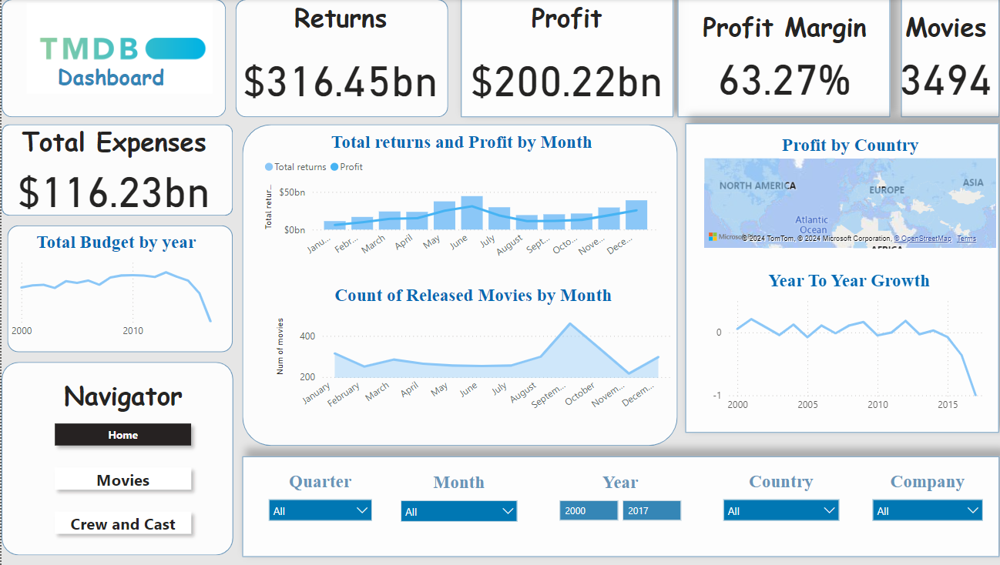
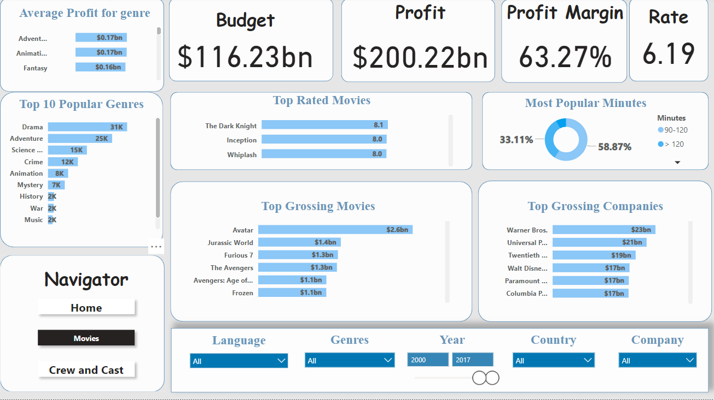
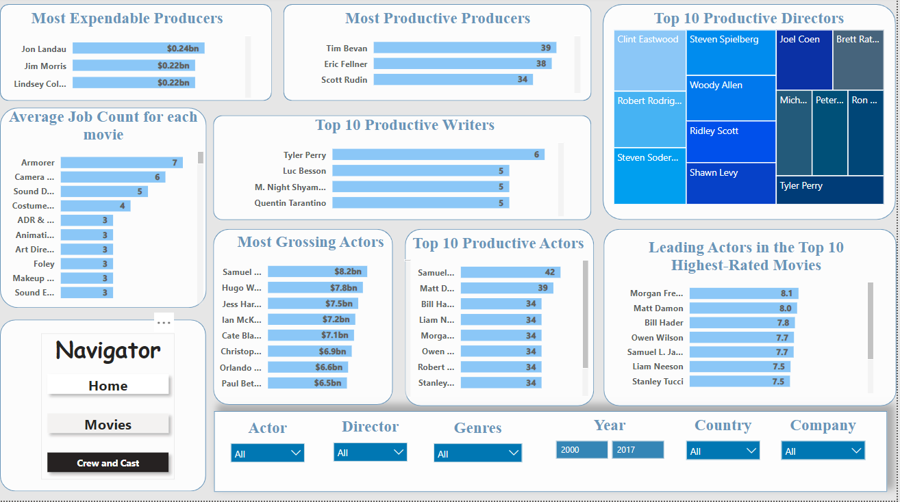
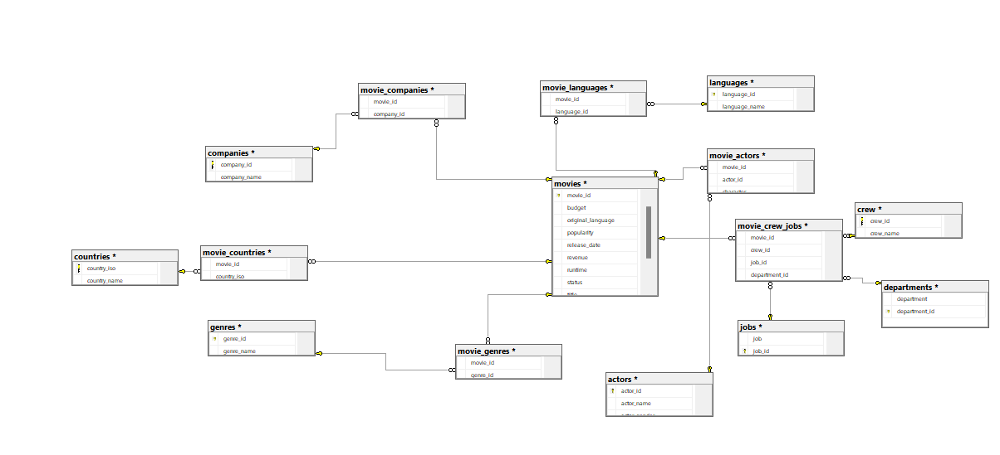

# Movie industry Dashboard

This project provides an analytical dashboard to explore trends, performance metrics, and insights within the movie industry. Designed to help stakeholders make data-driven decisions, this dashboard covers box office performance, genre popularity, and revenue breakdowns.
## Key Features

- **Box Office Analysis**: Visualizations of revenue trends across years, genres, and regions.
- **Genre Popularity**: Insights into trending genres over time.
- **Revenue Breakdown**: Comparison of production budgets versus box office returns.

## Visuals

### Dashboard and Reports
## Home Dashboard

## Movies Dashboard

## Cast and Crew Dashboard

### Database Schema

### Project Demo

## Project Structure

- **`data/`**: Dataset files used for analysis.
- **`scripts/`**: SQL and Python scripts for data transformation and cleaning.
- **`dashboard /`**: Power BI dashboard.
- **`images/`**: Contains images of the dashboard, and data model.
- **`videos/`**: Video demonstration of the project.

## Setup and Usage

1. Clone the repository.
2. Execute SQL scripts from `scripts/` in SQL Server.
3. Open `dashboard/tmdb.pbix` in Power BI, connect to the data source.
